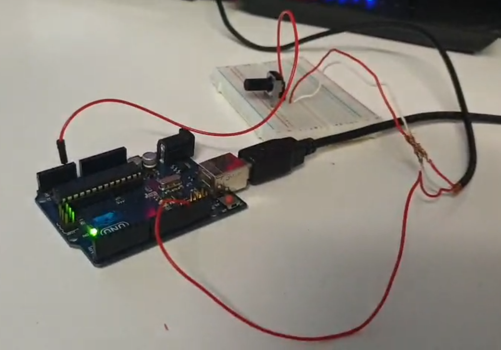

# Arduino PWM sound player
Arduino project that plays music through a single digital pin using pulse width modulation. Includes a Python utility to load music from MIDI files.

*Hardware setup*

## Usage

To play a midi file of your choice, first set the `SOURCE` variable in `midi_parser.py` to the path to your midi file and run the script. Then compile `player.ino` and upload the program to your Arduino.
In `player.ino` set the appropriate `SPEAKER_PIN` variable. You can configure the `maxpoly` variable to limit the amount of notes played at a time.

Note that the player can only play pulse tones, and does not differentiate between different instruments. You can remove drum tracks by modifying the `REMOVE_CHANNELS` variable in `midi_parser.py`.

## Example

https://github.com/MajFontana/arduino-ppm-sound-player/assets/48356730/8532e097-14d4-4d3e-93b6-9d94eef1ad24

*Arduino playing a MIDI adaptation of Field of Hopes and Dreams by Toby Fox*
